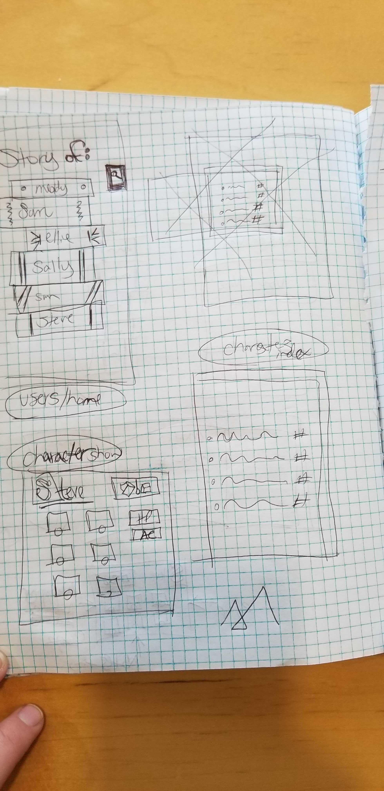

# Project4

The objective of this project was to build three models with Django, SQL, and React.  

# Dungeons + Dragons

* An easier way to manage characters with built in dice roller.

Heroku: https://dnd-project04.herokuapp.com/
GitHub: https://github.com/DestinFloyd/Project4
Trello: https://trello.com/b/aWEpYYly/project-4

# Opening 

# Wireframe 

